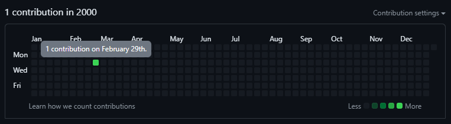

# Commits in the past

This project is short and only a placeholder to make commits in the past.


## 🗿 Authors

- [quentintyr](https://github.com/quentintyr)


## 🛠 Requirements
Any random project to commit.


## 🆕 Run on your own

First Create a new repository without a **readme.md file** on your GitHub profile. Then create a new project in VSCode or anything else. Then open git bash in your project folder.
Then run the following commands

```bash
git init
```

```bash
git add --all
```
please note that it does not work with years later than 1970 (last test)
```bash
git commit --date="YYYY-MM-DD HH:MM:SS" -m "COMMIT MESSAGE"
```

start pushing to your repository

```bash
git remote add <name> <url>
```

```bash
git push --set-upstream <name> master
```
On your profile you will now see commits have been made in the past.

## git add . / git add --all difference
Summary of Differences
```bash
git add --all
````
stages changes across the entire repository.
stages deletions.
```bash
git add .
```
stages changes only in the current directory and its subdirectories.
does not stage deletions.
